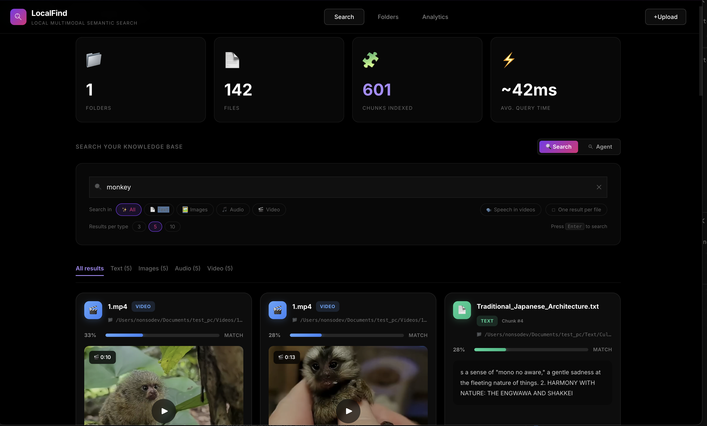
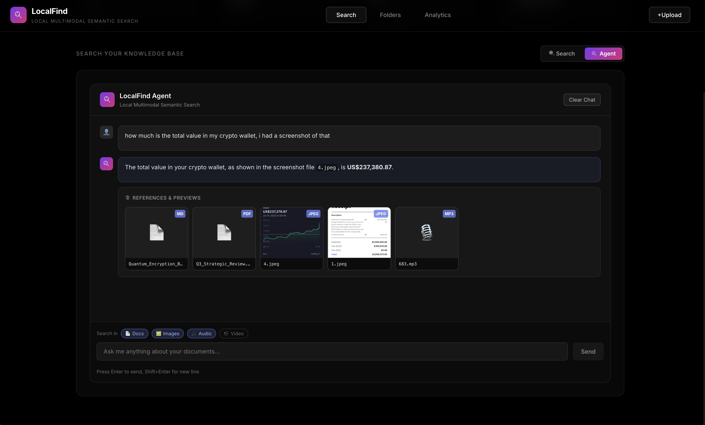
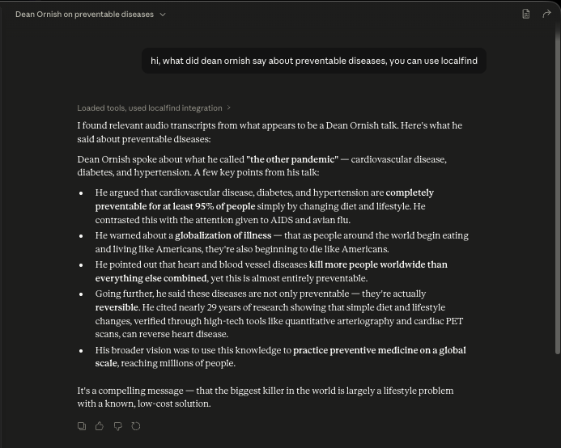

# LocalFind


Private, local, multimodal semantic search. Find your documents, images, audio, and video by what they *contain* — in natural language, in any of ~100 languages — with everything running on your own machine. No API keys, no cloud, no data leaving your device.


## Why local matters

Think about what's actually in your files — invoices, bank statements, medical records, personal photos, work documents under NDA, voice memos, private conversations. When you upload files to a cloud AI service, that data is processed on someone else's server and subject to their privacy policy.

LocalFind gives you the same capability — semantic search, vision understanding, conversational retrieval — without any of your data leaving your machine. The language and vision models run via [Ollama](https://ollama.ai/). Whisper runs locally. The vector store is on disk. Nothing is sent anywhere.

There is one optional exception: the Claude Desktop integration uses Claude, which is a cloud service. Files you query through Claude Desktop are sent to Anthropic's servers. Use it for files you're comfortable sharing with a third party. For sensitive files, use the built-in local agent instead.

## What it does

Most local search tools match filenames or do keyword search. LocalFind understands content:

- **Images searchable by what they look like** — out of the box, every image is embedded with CLIP and matched by visual similarity. Search "sunset over water" or "person at a whiteboard" and find visually matching images, not just filenames. Lightweight — no big model required. *(Optional: switch on a captioning model to also read text in images and search by description — see [Reading what's in images](#reading-whats-in-images).)*
- **Audio fully searchable** — Whisper transcribes recordings at index time. Search across hours of meetings or lectures by what was said, not just what the file is called. Results jump straight to the matching timestamp.
- **Video searchable by what's on screen** — videos are broken into scene-change keyframes at index time, each embedded with CLIP (or a captioning model). Search by what appears visually — "whiteboard session", "product demo", "graph showing growth" — and land on the exact frame. Enable the optional **Speech in videos** toggle to also match what was *said*. Results show the matched frame with a play button that seeks directly to that moment.
- **Agent reads your files to answer questions** — ask "what does that invoice total?" or "summarise the meeting notes from Tuesday" and the agent finds the file and answers. With a captioning model enabled, it can also read the content of images and video frames live. Text and audio Q&A work with any chat model. See [Using the agent](#using-the-agent).
- **Works in your language** — text, audio, and image *captions* are embedded with a model supporting ~100 languages in a shared cross-lingual vector space. Search in French and find English documents. (Pure CLIP visual search is English-centric; captioning unlocks full multilingual image search.)

Supported file types:
- Documents: PDF, DOCX, TXT, MD, CSV
- Images: JPG, PNG, GIF, BMP, WEBP
- Audio: MP3, WAV, FLAC, M4A
- Video: MP4, MOV, MKV, WEBM, AVI, M4V

## Screens

Multimodal search across documents, images, audio, and video:



Built-in agent that reads your files to answer questions directly:



Claude Desktop connected via MCP:



## How the models are used

**Indexing (default, lightweight):**
- **CLIP** (local, ~400 MB, no Ollama) — turns each image and video keyframe into a visual-similarity embedding.
- **Whisper** (local) — transcribes audio files and the audio track of videos, with timestamps.
- **`nomic-embed-text-v2-moe`** (via Ollama) — embeds all text: documents, transcripts, and any image captions.

That's the whole default pipeline — it runs comfortably on a normal laptop with no large vision model.

**Optional add-ons:**
- **A captioning vision model** (`IMAGE_CAPTIONING_BACKEND` = `qwen2.5vl:3b`, `gemma4:e2b`, etc.) — instead of CLIP, *describes* each image/frame in words, enabling OCR, reading text on slides/invoices, and searching images by description in any language. See [Reading what's in images](#reading-whats-in-images).
- **A chat model** (`AGENT_MODEL`, default `gemma4:e4b`) — powers the conversational agent. Optional; only needed for the agent feature. With a captioning/vision model enabled, the agent can also read images live to answer questions about them.

The model layer is just Ollama tags — swap in anything else (see [Use a different model](#use-a-different-model)).

## Model selection

### Agent (`AGENT_MODEL`)

| Model | Download | RAM needed | Notes |
|---|---|---|---|
| `gemma4:e2b` | ~7 GB | 12 GB | Works; use if e4b doesn't fit |
| `gemma4:e4b` *(default)* | ~9.6 GB | 16 GB | Recommended |
| `gemma4:31b-it-q4_K_M` | ~20 GB | 32 GB | Full 31B, 4-bit quant |
| `gemma4:31b-mlx-bf16` | ~32 GB | Apple Silicon M2/M3/M4 Max | Metal-optimised |
| `gemma4:31b-cloud` | 0 GB local | — | ⚠ Routes to Ollama servers — not private |

e2b and e4b both work as the agent. e4b follows tool-use instructions more reliably. Use e2b if e4b doesn't fit in your available RAM.

### Image / video-frame backend (`IMAGE_CAPTIONING_BACKEND`)

Controls how images and video keyframes are indexed. Think of it as three tiers — start at the default and move up only if you want better results:

| Tier | Backend | Download | What you get |
|---|---|---|---|
| **Default** | `clip` | ~400 MB (Python pkg) | Visual similarity only. Lightest, no Ollama model, runs anywhere. No captions/OCR. |
| **Add descriptions** *(recommended upgrade)* | `qwen2.5vl:3b` | ~3.2 GB | Natural-language captions + strong OCR / text-in-image (invoices, slides, charts). Small enough for most laptops. |
| **Best quality** | `gemma4:e2b` | ~7 GB | Top-quality captions and scene understanding. Heavier. |

Captioning unlocks OCR, reading text on screen, multilingual image search, and the agent reading images — see [Reading what's in images](#reading-whats-in-images). If you want maximum quality and have the RAM, `gemma4:e4b` (~9.6 GB) is the top end; otherwise any other Ollama vision tag works too.

**Switching:** between captioning backends is safe any time (shared index). Switching between `clip` and any captioning backend (either direction) requires a re-index — they use different collections. Run `rm -rf backend/chroma_db` and re-sync after changing.

### Reading what's in images

By default LocalFind matches images and video frames by **visual similarity** (CLIP) — great for "find pictures that look like this," and it needs no large model. It does **not** read text in images, generate descriptions, or let the agent answer questions about image contents.

To enable all of that, move up a tier — `qwen2.5vl:3b` is the recommended choice (small, excellent at text/OCR):

```bash
ollama pull qwen2.5vl:3b       # ~3.2 GB — recommended captioning upgrade
# or: ollama pull gemma4:e2b   # ~7 GB — best quality, heavier

# in .env:
IMAGE_CAPTIONING_BACKEND=qwen2.5vl:3b

rm -rf backend/chroma_db       # captions use a different index
# then re-sync your folders
```

With a captioning model on, each image/frame gets a natural-language description (embedded multilingually), so "the slide with the revenue chart" or "receipt from the coffee shop" works, and the agent can read images to answer questions.

### Searching video

Videos are indexed as two parallel streams at sync time — both are always captured, and you choose which to search at query time:

| Stream | What gets indexed | When it matches |
|---|---|---|
| **Visuals** *(default)* | Scene-change keyframes, each embedded with CLIP or a captioning model | Visual content on screen — "whiteboard with diagrams", "person presenting slides" |
| **Speech** *(opt-in)* | Whisper transcript of the audio track, chunked with exact timestamps | What was said — "where she explains the refund policy", "mention of Q3 revenue" |

**In the search UI:** select **Video** (or leave on **All**) and use the toggles in the search bar:
- **Speech in videos** — also matches what was *said*. Off by default so results are always real frames, not transcript snippets.
- **One result per file** — collapse multiple matches from the same video to just the best one.

Every video result shows the matched keyframe as a still image. Click it to play the video seeked directly to that moment.

**Captioning models unlock richer video search.** With `IMAGE_CAPTIONING_BACKEND=clip` (default) frames are matched by visual similarity only — good for scene/subject queries. Switch to `qwen2.5vl:3b` or `gemma4:e2b` to get natural-language descriptions of each frame, enabling searches like "the slide listing product features" or "a close-up of the circuit board". The same captioning setting applies to both images and video frames.

**Agent + video:** the built-in agent can search video frames and describe what's in them. Ask "what does the opening slide of that conference talk say?" and the agent finds the frame and reads it (requires a captioning/vision model — see [Reading what's in images](#reading-whats-in-images)).

### Use a different model

The agent and captioning backends are plain Ollama model tags — anything Ollama can run, LocalFind can use. To swap models, change `AGENT_MODEL` / `IMAGE_CAPTIONING_BACKEND` in `.env` and pull the model. For example:

```bash
# A different chat/vision family for the agent
ollama pull llama3.2-vision        # then set AGENT_MODEL=llama3.2-vision
ollama pull qwen2.5vl              # then set AGENT_MODEL=qwen2.5vl

# An earlier Gemma generation
ollama pull gemma3:4b             # then set AGENT_MODEL=gemma3:4b
```

The agent works best with a model that supports both **vision** (to read images) and **tool calling** (to decide when to search). Pure-text models still work for document and audio search but can't answer questions about image contents. The `clip` captioning backend is the only non-Ollama option (it uses OpenCLIP locally).

### Embedding model (`TEXT_EMBED_MODEL`)

`nomic-embed-text-v2-moe` (default, ~958 MB) — multilingual Mixture-of-Experts model supporting ~100 languages. Used for all text, audio transcripts, and image captions. The embedding space is cross-lingual: similar meaning maps to nearby vectors regardless of language, so a French query naturally retrieves English documents without any translation step.

## Quick start

### Prerequisites

- Python 3.10+
- [`uv`](https://github.com/astral-sh/uv)
- Node.js 18+
- ffmpeg
- [Ollama](https://ollama.ai/)

Windows only: Microsoft C++ Build Tools recommended for native Python package builds.

### Install

**1. Clone**
```bash
git clone https://github.com/nonsodev/localfind.git
cd localfind
```

**2. Copy environment file**
```bash
cp .env.example .env
# Edit .env to change models or ports
```

**3. Virtual environment**

macOS / Linux:
```bash
uv venv
source .venv/bin/activate
```

Windows PowerShell:
```powershell
uv venv
.venv\Scripts\Activate.ps1
```

**4. Backend dependencies**
```bash
cd backend
uv pip install -r requirements.txt
```

**5. ffmpeg**
```bash
# macOS
brew install ffmpeg

# Linux (Ubuntu/Debian)
sudo apt install ffmpeg

# Windows
winget install ffmpeg
```

**6. Frontend dependencies**
```bash
cd ../frontend
npm install
```

**7. MCP server** (only if you want Claude Desktop integration)
```bash
cd ../mcp_server
uv pip install -r requirements.txt
```

**8. GPU acceleration** (optional)

NVIDIA (Windows/Linux):
```bash
uv pip install torch torchvision --index-url https://download.pytorch.org/whl/cu118
```

Apple Silicon: Metal (MPS) is used automatically, no extra steps.

**9. Pull models**

Only one model is required for the default setup — the multilingual text embedder. Image/video indexing uses CLIP (no Ollama model), and Whisper downloads itself on first run.

```bash
ollama pull nomic-embed-text-v2-moe   # multilingual embeddings (~958 MB) — required
```

**Optional — the conversational agent** (`AGENT_MODEL`, default `gemma4:e4b`):
```bash
ollama pull gemma4:e4b    # ~9.6 GB — needed only if you use the agent feature
# lighter agent options: gemma4:e2b (~7 GB), or any Ollama chat model
```

**Optional — read text in images / search images by description** (set `IMAGE_CAPTIONING_BACKEND` in `.env`, then re-index):
```bash
ollama pull qwen2.5vl:3b   # ~3.2 GB — recommended captioning upgrade (great OCR)
ollama pull gemma4:e2b     # ~7 GB   — best quality, heavier
# default `clip` needs no Ollama model
```

### Run

**Backend** (terminal 1):
```bash
cd backend
uvicorn main:app --reload --host 0.0.0.0 --port 8000
```
First run downloads the Whisper model (~1.5 GB).

**Frontend** (terminal 2):
```bash
cd frontend
npm run dev
```

UI: `http://localhost:5173`

**Or use the convenience scripts:**
```bash
./start.sh
./stop.sh
```

## Using the agent

The built-in agent is a local chat interface powered by an Ollama model (`AGENT_MODEL`, default `gemma4:e4b`). It decides when to search your files and answers conversationally:

- **Text and documents** — finds relevant chunks, quotes them in the answer.
- **Audio** — finds matching transcript segments, answers from the words that were spoken.
- **Images** — finds the matching image, then calls a vision model to read its contents and answer (requires a captioning/vision model; CLIP-only mode can find the image but can't describe it in words).
- **Video frames** — same as images: finds the best matching keyframe, reads what's on screen with the vision model, answers your question. "What does the title slide of that talk say?" or "Find the frame showing the architecture diagram" — the agent returns both an answer and the frame it found.

The agent searches visuals only for video (not speech), so every result it works with is a real frame it can actually see.

To use the agent: start both backend and frontend, open the **Agent** tab, and chat naturally. The agent only searches when you clearly ask about your files — for general questions it answers directly without searching.

## Claude Desktop

> **Privacy note:** Claude Desktop is a cloud service. Files you query through it are sent to Anthropic's servers. Use it for files you're comfortable sharing with a third party. For sensitive files, use the built-in local agent.

Add to `claude_desktop_config.json`:

```json
{
  "mcpServers": {
    "localfind": {
      "command": "/absolute/path/to/localfind/.venv/bin/python",
      "args": ["/absolute/path/to/localfind/mcp_server/server.py"],
      "env": {
        "BACKEND_URL": "http://localhost:8000"
      }
    }
  }
}
```

Replace `/absolute/path/to/localfind` with the actual path where you cloned the repo. The `command` must point to the Python inside the virtual environment created during setup — not the system Python, which won't have the MCP dependencies installed.

Setup notes:
- Start the LocalFind backend before using Claude Desktop.
- Enable the Filesystem connector (Claude Desktop → Settings → Connectors) if you want Claude to inspect image files and video frames, not just receive their paths.
- Change `BACKEND_URL` if your backend runs on a different port.

What works in Claude Desktop:
- Text search
- Audio transcript search
- Image search (captions + file paths) — full image inspection requires the Filesystem connector
- Video search — video results are returned as keyframe images. Claude can describe what's on screen in the matched frame. Seeking / playback is only available in the LocalFind UI.

## Benchmarking captioning speed

Before committing to a captioning backend, test it on your own images:

```bash
python scripts/benchmark_captioning.py /path/to/images --count 5
```

Each model is fully unloaded between runs so timings don't bleed across models. The output separates cold-start time (includes model load) from warm-run time (model already in memory) — the warm number is what matters day-to-day.

## Repo layout

```
backend/       FastAPI backend, indexing, Whisper transcription, agent
frontend/      React + Vite UI
mcp_server/    MCP server for Claude Desktop
docs/          Architecture and operational guides
scripts/       benchmark_captioning.py and other utilities
```

## Documentation

- [Quick Reference](./docs/QUICK_REFERENCE.md)
- [Agent Quick Start](./docs/AGENT_QUICKSTART.md)
- [Agent Integration](./docs/AGENT_INTEGRATION.md)
- [Architecture](./docs/ARCHITECTURE.md)
- [Multimodal RAG Guide](./docs/MULTIMODAL_RAG_GUIDE.md)
- [Whisper Audio Guide](./docs/WHISPER_AUDIO_GUIDE.md)

## Roadmap

See [ROADMAP.md](./ROADMAP.md) for where the project is headed and [good first issues](https://github.com/nonsodev/localfind/labels/good%20first%20issue) if you'd like to help.

## Contributing

Contributions are welcome. See [CONTRIBUTING.md](CONTRIBUTING.md).

## License

MIT — see [LICENSE](LICENSE).
